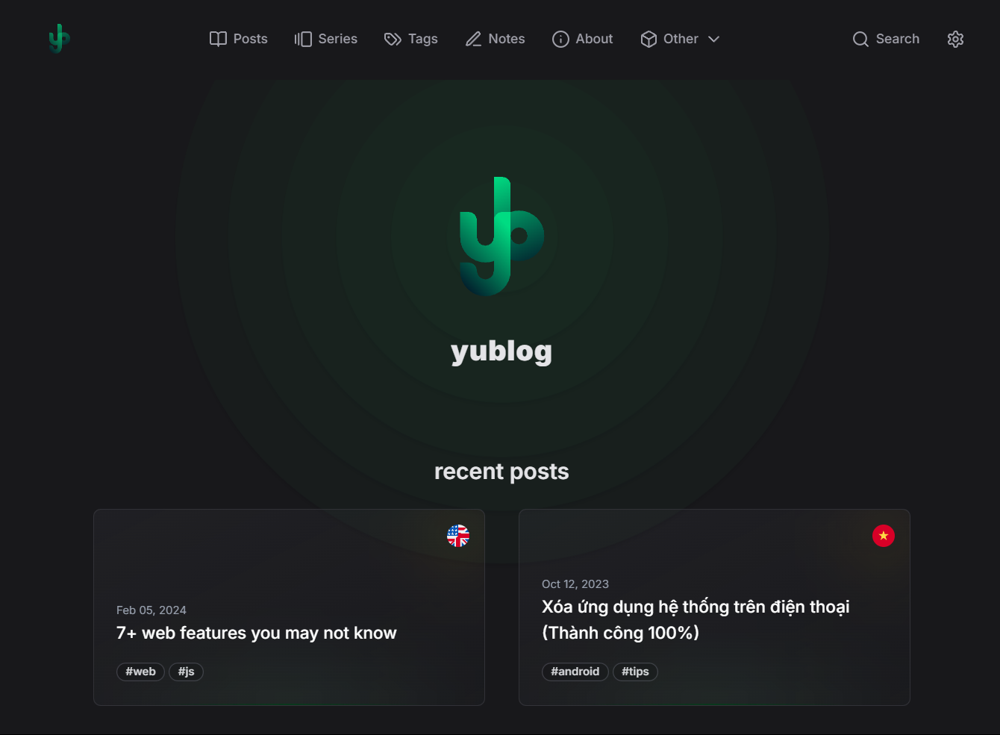
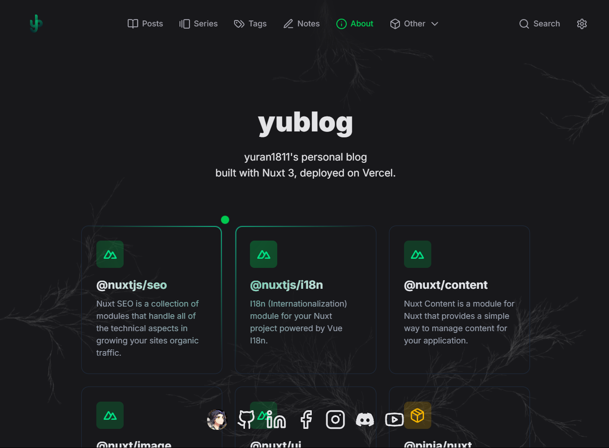
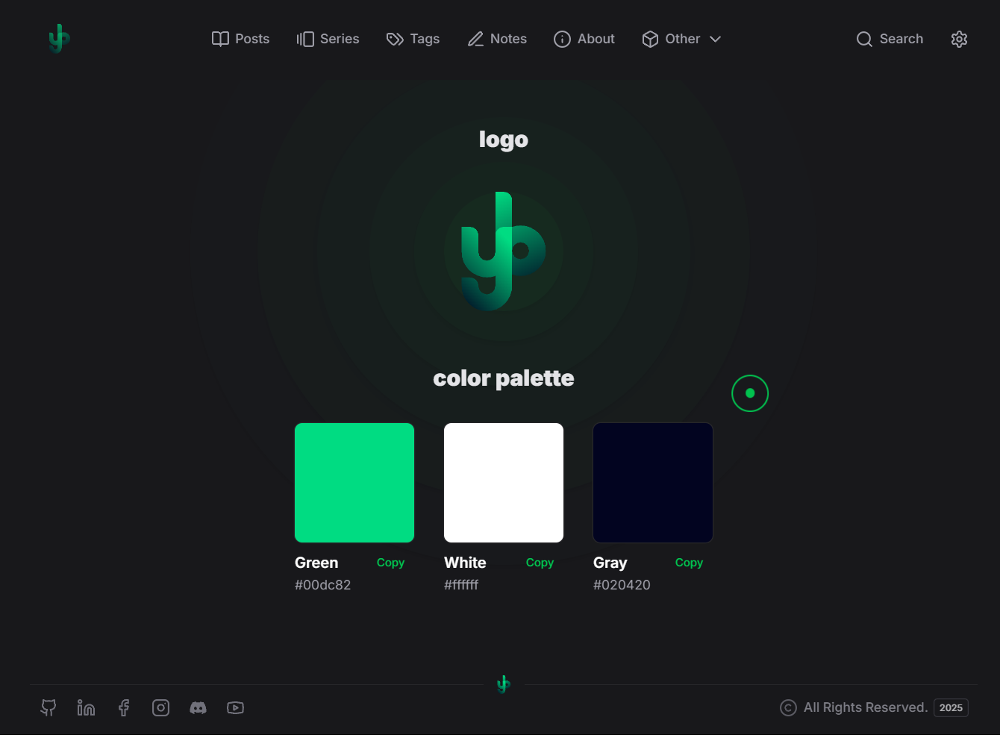
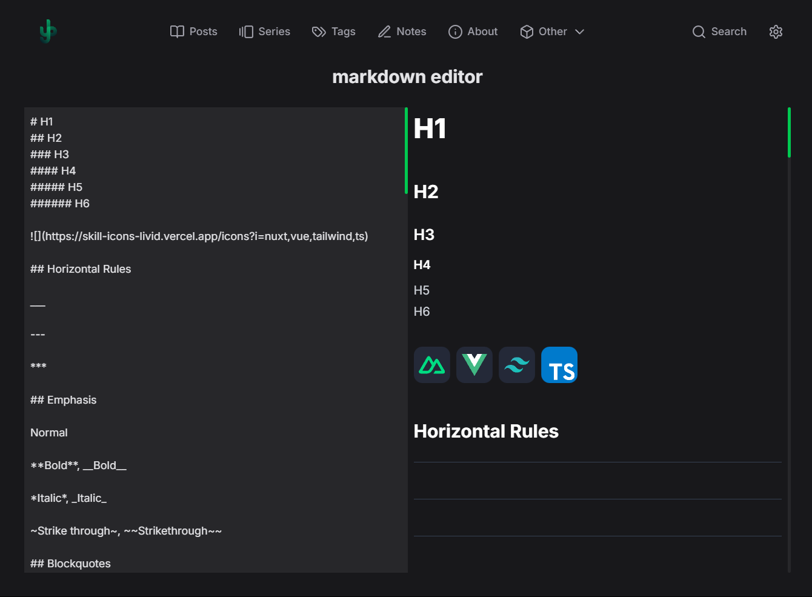

<h1 align="center">yublog-nuxt</h1>
<p align="center" style="font-size:16px"><strong>yuran1811's personal blog built with Nuxt</strong></p>
<p align="center">
  
</p>

<p align="center">
  
  
  
  
  
</p>

<div align="center">
  <a href="https://yublog-nuxt.vercel.app" target="_blank">Official Link</a>
</div>

## Introduction

- My personal blog built with `nuxt`, `@nuxt/content` and other cool tools for seo, llms, markdown, i18n, ...

## Features

- Markdown support with `@nuxt/content`
- SEO with `@nuxtjs/seo`
- LLMs with `@nuxtjs/llm`
- Multi-language support with `@nuxtjs/i18n`

## Tech Stack


## Screenshots

<div style="display:flex;gap:12px;justify-content:center;flex-wrap:wrap">
  
  
  
  
  
  
</div>

## Quick Start

Follow these steps to set up the project locally on your machine.

**Prerequisites**

Make sure you have the following installed or downloaded on your machine:

- [Git](https://git-scm.com/)
- [Node.js](https://nodejs.org/en)

**Cloning the Repository**

```bash
git clone https://github.com/yuran1811/yublog-nuxt.git
cd yublog-nuxt
```

**Installation**

- Enable `pnpm` to build and run the project

```bash
corepack enable pnpm
```

Install the project dependencies:

```bash
pnpm install
```

**Running the Project**

```bash
pnpm dev
```

Open [http://localhost:3000](http://localhost:3000) in your browser to view the project.
